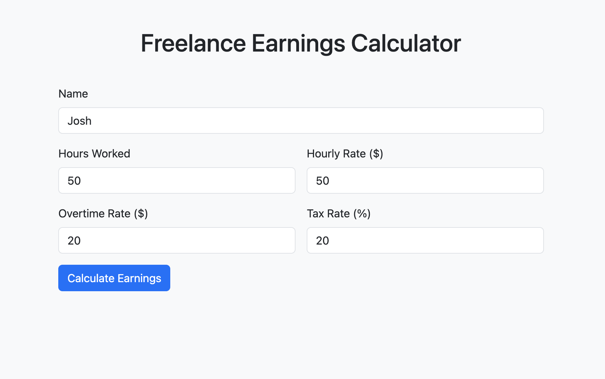
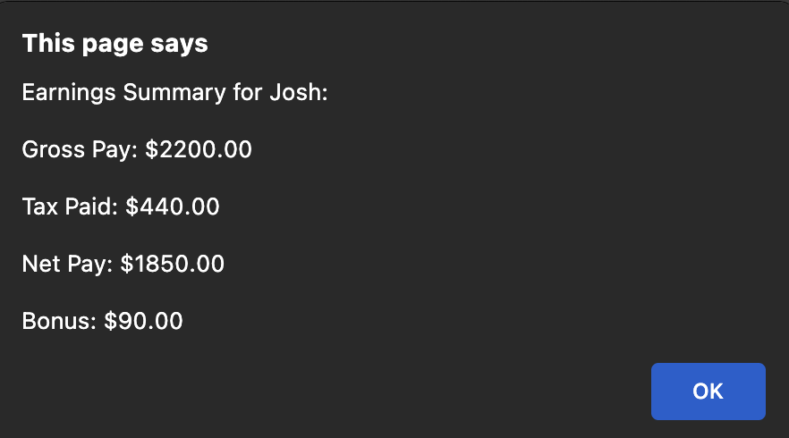

# Freelance Earnings Calculator

A responsive web app that calculates freelance earnings including overtime, tax, and bonuses. Built with **HTML**, **Bootstrap**, and **JavaScript**.  

---

## **Key Features**

- Input fields for: Name, Hours Worked, Hourly Rate, Overtime Rate, Tax Rate  
- Calculates: Regular pay, Overtime pay, Gross pay, Tax paid, Net pay, Bonus  
- Validates user input to prevent errors  
- Displays results in a **user-friendly alert** and logs summary to the console  
- Clean, responsive layout using **Bootstrap**  

---

## **Technologies Used**

- HTML5  
- CSS3 (Bootstrap 5.3.2)  
- JavaScript (ES6+)  

---

## **Screenshots**

**Form Input:**  
  

**Earnings Summary Alert:**  
  

**Console Output:**  
  

---

## **What I Learned**

- How to **grab and validate form input** in JavaScript  
- Using **event listeners** to trigger calculations  
- Performing **conditional calculations** for overtime and bonuses  
- **Formatting numbers** for currency output  
- Applying **Bootstrap classes** to create a responsive and clean UI  
- Understanding the difference between `const` and `let`  

---

## **Portfolio Highlight**

This project showcases my ability to:  
- Build interactive, user-driven web applications  
- Apply **JavaScript logic** for real-world calculations  
- Combine **front-end design and functionality** effectively  

